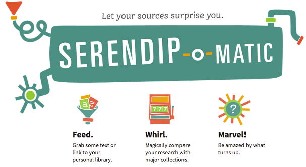

##Serendip-o-matic 
###[Start teaching with Serendip-o-matic](http://serendipomatic.org/) 

###Overview 

###Documentation 

Read more [here](http://serendipomatic.org/about/)

##Suggested Activities 

### Activity One 

