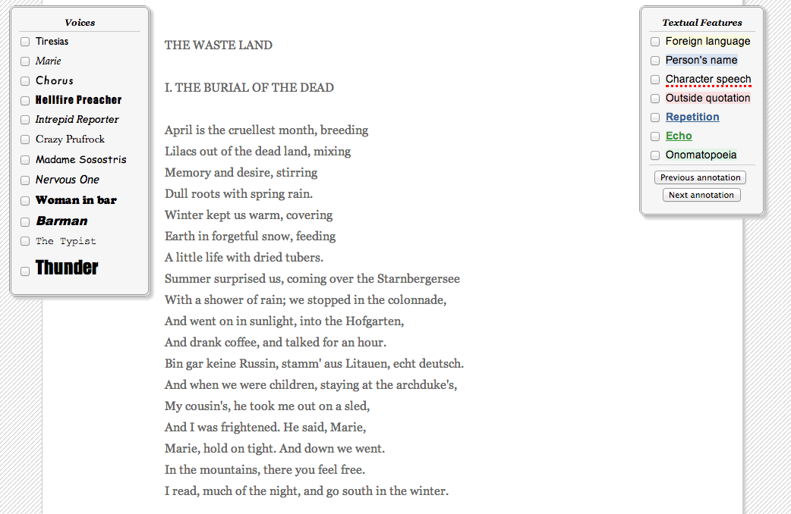

##He Do the Police in Different Voices 
###[Start teaching with He Do the Police](http://hedothepolice.org/) 

###Overview 

He Do the Police in Different Voices provides an open access edition of T.S. Eliot's "The Waste Land" that indicates instances of foreign speech, character speech, repetition, and other textual features. The tool also offers a venue for marking shifts in speakers in the poem, exploring "The Waste Land" as a polyvocal work. Users can view shifts in vocality as determined by computational methods and by crowdsourcing, as well as adding their own interpretation online.

Another website, entitled [The Brown Stocking](http://brownstocking.org/) offers a similar approach to reading Virginia Woolf's *To The Lighthouse*.

###Documentation 

An overview of the entire site is available at the project's [home page](http://hedothepolice.org/) and instructions for marking the text for shifts in vocality are available [here](http://hedothepolice.org/yoursay/).

##Suggested Activities 

###Introduction to close reading Poetry 

Provide students with this online edition of "The Waste Land" to introduce the poetic concepts--textual features--that are identified in the text. Students can read the poem two times, first without any notes and then with notes included, to gain a sense of how elements of language influence poetic meaning.

###Mapping shifts in poetic vocality 

Offer students a hands-on experience with poetic speakers and shifts in poetic vocality by asking them to mark the text for vocal shifts as part of the "have your own say" feature. As a class, discuss instances where students differed in their marking and how the differences open new possibilities for interpretation.