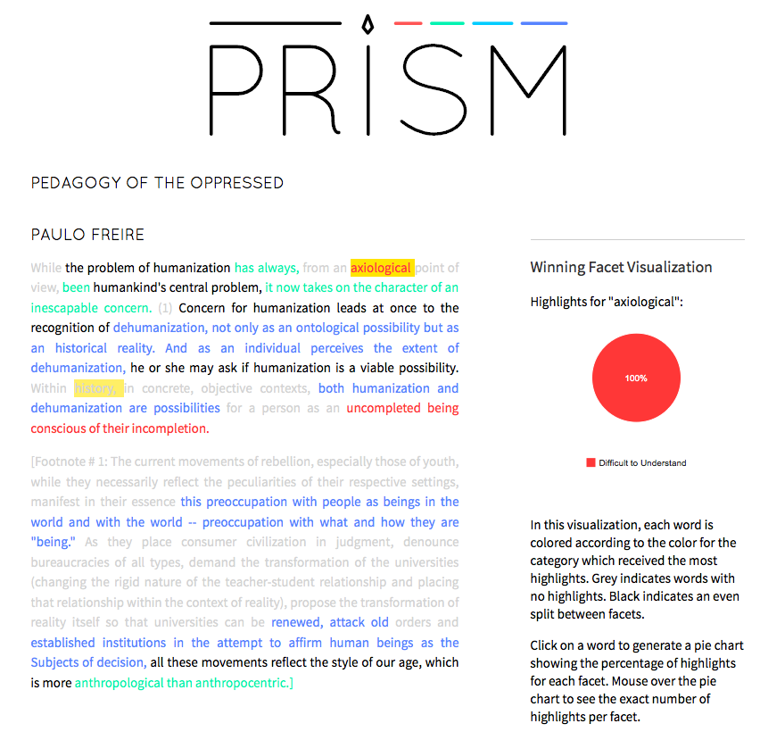

##PRISM 

###[Start teaching with PRISM](http://prism.scholarslab.org/) 

###Overview 

PRISM is a tool for crowdsourced interpretation created by Scholarslab. It lets multiple contributors add their interpretations of texts online by highlighting key terms, concepts, and sections in the text. The aggregate interpretation of multiple contributors can then be visualized through the tool.

[Read more about PRISM](http://prism.scholarslab.org/pages/about?locale=en).

###Documentation 

<embed width="560" height="315" src="//www.youtube.com/embed/AxHDcW15UBI">

##Suggested Activities 

###PRISM in the Classroom 

Read this introduction to using PRISM in the classroom, with a focus on teaching James Joyce's *A Portrait of the Artist as a Young Man*. In this post, Brandon Walsh offers a pedagogical overview to PRISM and explains how to use PRISM to generate and frame classroom discussions of literary texts. Walsh's teaching exercise asks students to work through the differences between realism and modernism thorugh a close, collaborative reading of Joyce's *Portrait*. This exercise uses PRISM to teach the concept of the binary and invite students to push past its limits.

[Read "PRISM in the Classroom"](http://bmw9t.github.io/blog/2014/09/16/prism-pedagogy/) by [Brandon Walsh](https://twitter.com/walshbr)

###Close reading poetry 

Chuck Rybak's assignment asks students to identify poetic devices, as well as difficult passages, using PRISM. For this assignment, Rybak uses PRISM to identify comprehension, confusion, and concrete images in Rimbaud's poem "Metropolitan." Students are asked to write a one-page reflection based on their work, and samples of these student reflections demonstrate how they arrived at close readings of Rimbaud's poem through this exercise.

[View the assignment](http://www.sadiron.com/dh-toe-dip-prism/) by [Chuck Rybak](https://twitter.com/chuckrybak)

###Teaching Latin American History 

Norah Andrews's exercise uses PRISM to mark up historical texts. This exercise asks students to mark up Maria Eugenia Echenique’s essay “The Emancipation of Women” (1876), focusing on Legal Culture, Gender Roles, and Progress. This exercise reveals as much about the points of confluence and division in the class as it reveals about the historical text in question.

[View the exercise](http://norahandrews.com/2014/05/07/a-successful-lesson-with-prism/) by [Norah Andrews](https://twitter.com/NorahLAndrews)

###Active reading exercise 

Use highlighting to introduce students to active reading. Ask the class to map their way through a text by marking up for repeated concepts, language, etc. This exercise can be extended to introduce concepts such as free indirect speech and imagery, to distinguish between mood and tone, etc.

###Identifying sources of difficulty in a reading 

Add an assigned reading to PRISM and ask students to highlight the text for difficulty as part of their homework. View the sections marked difficult by the majority of students and address them in class.

